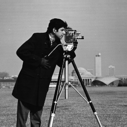
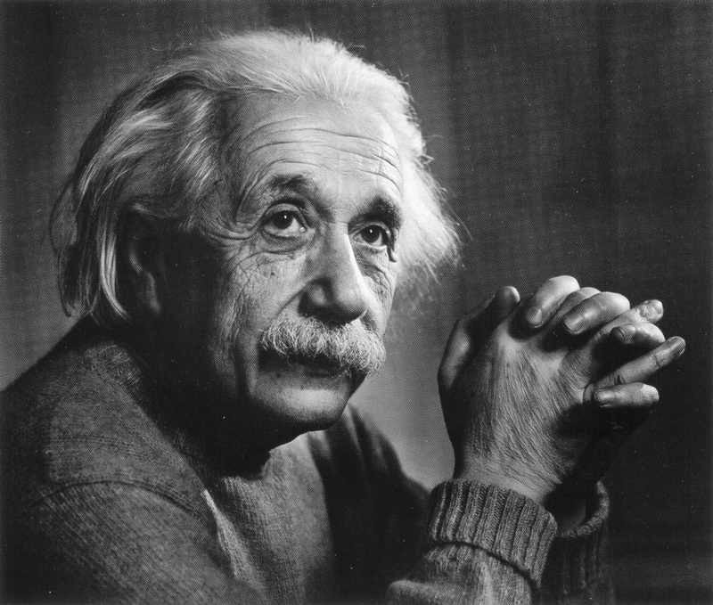
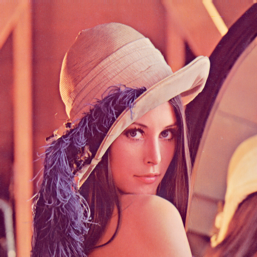

# 计算机视觉作业

## 作业介绍

本作业复现了`Mean Shift`在图像平滑方面的应用。主要的实现文件如下：

* `image_io.h, image_io.cc`：使用[FreeImage](https://freeimage.sourceforge.io/)实现对图像的读取和保存。读取数据的时候会将数据转成三个通道以便于后续的处理。

* `mean_shift.h, mean_shift.cc`：实现了`Mean Shift`算法，主要函数为

  ``` c++
  MeanShift(unsigned char* value, unsigned char* output, size_t height,
            size_t width, int sw, double th, size_t channel = 3,
            size_t max_iter = 5)
  ```

  参数：
  * `value`: 输入的图像数据，数据按`H x W x C`进行排列
  * `output`：输出数据，与输入数据尺寸保持一致
  * `height, width`：输出图像的高度以及宽度
  * `sw`：平滑的窗口大小
  * `th`: 判断颜色空间的距离阈值
  * `channel`: 输入数据的通道数量，默认为`RGB`三通道
  * `max_iter`：迭代次数

* `main.cc`：实现主函数，以及对参数进行解析

## 编译

### 测试平台

* CMake: `3.21.4`
* Visual Studio 2019
* Window SDK: `10.0.17134.0`

### 编译步骤

1. `cd source && mkdir build`
1. `cd build && cmake ..`
1. `cmake --build .`

编译好的文件已经放到`binary`文件夹下。

### 运行方式

默认会在编译目录`build/Debug`或`build/Release`输出`homework.exe`文件，在代码的根目录使用如下命令即可进行执行：

``` bash
./build/Debug/homework.exe example/lean512color.png --output example/lean512color_result.png
```

也可以指定窗口大小以及阈值：

``` bash
./build/Debug/homework.exe example/lean512color.png \
  --output example/lean512color_result.png \
  --window-size=10 --threshold=10
```

### 程序执行的输出示例

``` raw
Loaded the image: 512 x 512
Start mean shift: window size = 50, threshold = 50.000000
Done! save the result to "example\lena512color_result.png"
```

## 结果展示

### 1. caneranan

<center>
  
  
</center>

左侧为原始图像，右侧为输出图像。窗口大小50，阈值50。

### 2. einstein

<center>
  
  
</center>

左侧为原始图像，右侧为输出图像。窗口大小50，阈值50。

### 3. lena512color

1. 左侧为原始图像，右侧为输出图像。窗口大小20，阈值50。

<center>
  
  
</center>

2. 左侧为原始图像，右侧为输出图像。窗口大小50，阈值50。

  <center>
    
    
  </center>

3. 左侧为原始图像，右侧为输出图像。窗口大小100，阈值50。

<center>
  
  
</center>

4. 左侧为原始图像，右侧为输出图像。窗口大小50，阈值10。

<center>
  
  
</center>

5. 左侧为原始图像，右侧为输出图像。窗口大小50，阈值100。

<center>
  
  
</center>
