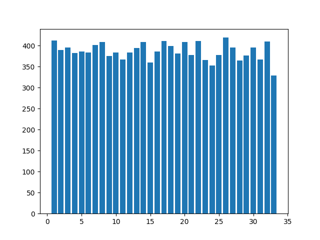
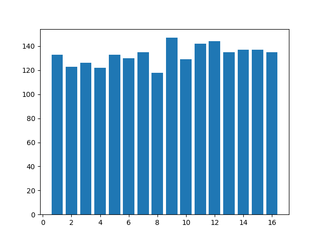
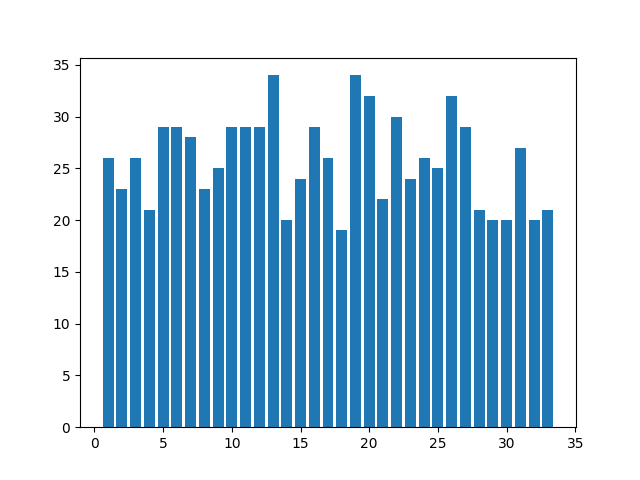
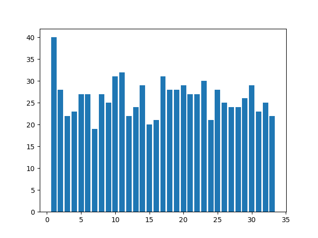

基于机器学习的双色球彩票分析
===

基本介绍
---

随着机器学习的快速发展，人们将机器学习算法应用于各种领域，并在一些领域取得了很好的效果，能够逼近甚至强于人类。加之GPU的发展，解决了深度学习算法计算性能瓶颈，使得深度学习得到空前的发展。

双色球是福利彩票的一种，分为红色球和蓝色球。红色球从`1-33`号球中选取`6`个，蓝色球从`1-16`号球中选出`1`个。具体的中奖金额请自行查阅相关介绍，这里不再介绍。本文主要集中于使用机器学习算法对双色球进行分析，探索使用机器学习算法预测双色球的可能性。

本文先是使用基本的一些统计学概念对数据进行统计，得出一些基本理论。然后使用基础的机器学习算法，研究机器学习来预测双色球的可能性。最后，使用神经网络进一步探讨复杂神经网络能够解决双色球彩票问题。

双色球统计特性
---

首先，对历年的数据进行统计分析，得到红色球和蓝色球的分布如下：

从上面两个图可以看出，双色球在历年的数据中，分布基本上都是属于平均分布的，符合随机性的特点。

另外，我们想要了解蓝色球和红色球之间是否存在一定的关系，于是，统计蓝色球出现的时候，对应红色球的分布。下图给出当蓝色球为`10`以及`11`的时候，红色球出现次数的分布：

上图可以看出分布大体还是趋向于均匀分布的，但是大部分的图都会存在一个较高的点，但领先的并不是很多。

在统计学的意义上，就目前拥有的数据来说，大体都是处于随机分布，并不能看出什么关系。

马尔科夫链
---

马尔科夫链的提出是为了解决自然变化的一般规律模型，是现代概率论随机过程理论中的一个重要方面。人们在对实际问题的研究中发现随着时间的持续发展变化会产生很多的现象。其中有一些现象或过程可以表述如下：在“现在”是已知的情况下，这种变化过程的“未来”与“过去”是毫无联系的。也就是说这种过程的未来所出现的情况不依赖于过去的发展变化，我们就把具有上述性质的过程称之为马尔可夫过程。

这里使用离散型马尔科夫链变量进行预测验证：
* 状态分类：对于离散变量来讲，首先要把目标的数据进行归类。对模型来说，状态都必须是有限的。可将红色球分为11个状态，每个状态有3个数。蓝色球分为8个状态，每个状态有2个数。
* 计算转移概率矩阵：转移概率矩阵根据历史数据的频率统计得到，假设$f(i, j)$表示状态$i$到状态$j$的次数，那么概率转移矩阵为$p(i, j) = f(i, j)/f(i.)$
* "马氏性"检验：对于离散型的变量，需要利用历史数据进行检验，公式如下：
$$ \chi^2 = 2\sum_{i=1}^m\sum_{j=1}^m{f_{ij}\mid\ln\frac{p_{ij}}{p_{.j}}\mid}$$
    然后根据显著水平来获取自由度的阈值`m`，需要其满足$ \chi^2 > \chi_\alpha^2\big((m - 1)^2\big) $。
* 计算自相关系数和各种步长的权重：当满足马氏性后，便可以预测下一状态，预测根据滞时`k`，进行调整，权重为`W(k)`根据自相关系数`R(k)`确定，公式如下：
$$ r_k =  \frac{\sum_{l=1}^{n-k}{(x_l - \overline{x})(x_{l+k} - \overline{x})}}{\sum_{l=1}^{n}{(x_l - \overline{x})^2}} $$
$$ w_k = \frac{\mid r_k \mid}{\sum_{k=1}^{m}{\mid r_k \mid}} $$
    其中，`l`表示历史的数据次数，`x`为历史数据序列。
* 根据不同的滞时期的转移概率矩阵：根据`C-K方程`提供的算法，计算`k`步的转移概率矩阵$P_i^{(k)}$，又一次转移概率矩阵自乘 `k`次得到。
* 预测下一个状态：下一个状态的预测概率通过相同状态的各个预测概率加权和得到：
$$ P_i = \sum^m_{k=1}{w_kp_i^{(k)}}, i \in E $$

使用上述描述的算法，对双色球进行集建模，单个号码随机概率准取率在16%左右，将所有的号码猜中的概率微乎其微。因此，使用马尔科夫链形式进行建模，预测随机概率，得到的准确度并不是很高。也证实了我们在统计中符合随机性假设。

LSTM
---

我们继续深入使用深度神经网络来对该问题进行建模，这里使用了**LSTM**网络，是一种RNN的特殊类型，可以学习长期依赖信息。LSTM通过一些灵巧的设计来避免长期依赖问题。LSTM 的关键就是细胞状态，水平线在图上方贯穿运行。细胞状态类似于传送带。直接在整个链上运行，只有一些少量的线性交互。信息在上面流传保持不变会很容易。LSTM 拥有三个门，来保护和控制细胞状态。让我们回到语言模型的例子中来基于已经看到的预测下一个词。在这个问题中，细胞状态可能包含当前主语的性别，因此正确的代词可以被选择出来。当我们看到新的主语，我们希望忘记旧的主语。

因此，使用LSTM算法对双色球的数据进行分析再合适不过了。使用Keras简单构建LSTM网络，输入为`one-hot`编码的数据，输出则给出每个数字对应的预测概率。为了能够更好的进行的预测，并不是绝对的在红球中选取`6`个以及在蓝色球中选取`1`个，而是多预测几个。这样就能够进一步针对上次已有的结果，研究每天数据变化的时候，数据的中位数或者平均数的变化特征。然后在多预测的数据中进行选取，相对于精确的预测，范围的预测应该是更为准确的。对于范围的预测也能够为彩票的选购提供一种选择。因此，使用范围的预测是可行的。

经过多个轮回的训练，精确的预测的概率为0，也就是说使用深度学习算法并不能够做到精确的预测。而我们之前讲过的概率预测，在红球中，我们选取`10`个，而不是`6`个的话，概率大概能够达到百分之一左右，这个概率还是特别低的。

因此，简单的使用深度学习算法对彩票进行预测这条路是走不通的。

另外，还尝试将前两期的号码作为输入，然后编码成图像，使用卷积神经网络进行预测，得到的概率也是特别低的。因此彩票的预测也并不能够使用图形学相关的深度学习算法进行预测。

总结
---

在统计学上，针对多期的双色球数据进行分析，数据基本上是随机分布的，并无法找到简单的规律。另外，使用了马尔科夫链将双色球的每期看作是一个过程，从上一期到下一期数据的变化看作是马尔科夫的状态转移，使用这种模型对下一期的结果进行预测，成功预测的概率是微乎其微的，并不是一个好的方案。于是使用深度学习的方法进行分析，在精确的预测上也是不可能的，只能够预测一定的范围。范围小了预测的准确性也随之下降，因此也不是一种好的方案。其次，将数据编码成图形，使用卷积神经网络进行预测，得到的结果也是类似的。

因此，本文通过多种方法，目前没有能够找到一个有效的方法进行彩票的预测，在统计意义上，彩票的分布是随机的。虽然人工智能能够模拟很多人能够做的事情，但是对于纯随机的事件而言，无论是机器学习还是深度学习，都无法做到精确的预测，毕竟前一期结果和后一期结果并不存在什么联系，即使存在，每两期之间的联系也是变化的，无法通过定性的分析来得到这种联系。

最后，彩票是一个随机的事件，也是一个很玄学的东西，不要过分沉迷其中。
