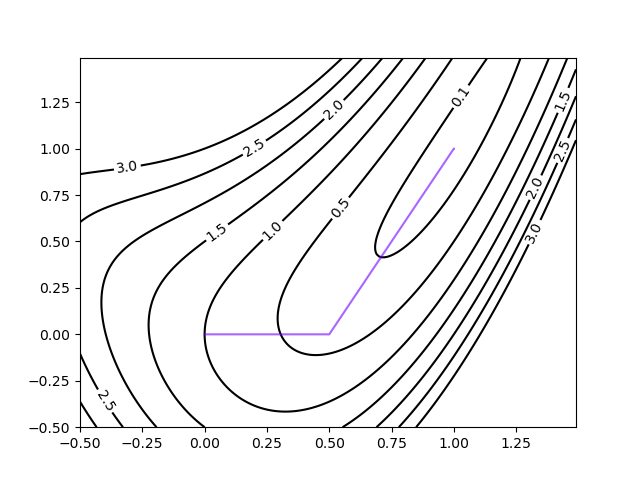

# 说明文档

## 最速下降方向

### 算法过程

迭代更新部分的实现如下，其余部分在`steepest.py`中：

``` python
d = dx(points) # 计算梯度方向
if np.linalg.norm(d) < self.threshold_: # 判断是否达到阈值
  break
d = self.norm(d) # 计算范数下的优化方向
# 直线查找
alpha = linear_search(points, self.X_, self.FX_, d, self.threshold_ / 10)
# 更新值
points = points + alpha * d
```

### $L_1$范数的优化方向

优化方向计算如下：

``` python
d = np.zeros_like(values)
i = np.argmax(np.abs(values))
d[i] = np.sign(-values[i])
```

首先找到最大值，即$L_\infty$范数。该值的方向梯度应为$1$，其余为$0$。

#### 结果

迭代次数：131次，最终结果：$1.16 \times 10^{-8}$

1. 函数值随着迭代次数增加变化曲线如下：
  
2. 迭代过程中决策变量在等值线上的变化曲线
  

### $L_2$范数的优化方向

``` python
d = -values / np.linalg.norm(values)
```

#### 结果

迭代次数：131次，最终结果：$6.55 \times 10^{-9}$

1. 函数值随着迭代次数增加变化曲线如下：
  
2. 迭代过程中决策变量在等值线上的变化曲线
  

### $L_\infty$范数下的优化方向

``` python
d = np.sign(-values)
```

迭代次数：96次，最终结果：$1.35 \times 10^{-8}$

#### 结果

1. 函数值随着迭代次数增加变化曲线如下：
  
2. 迭代过程中决策变量在等值线上的变化曲线
  

## 共轭梯度算法

迭代更新部分的实现如下，其余部分在`steepest.py`中：

``` python
d = -self.dx(x) + alpha * d # 更新优化方向

# 判断是否达到阈值
if np.linalg.norm(d) < self.threshold_:
  break
# 线性搜索
l = linear_search(x, self.X_, self.FX_, d, self.threshold_ / 10)
x0 = np.copy(x)
x = x + l * d # 更新下一个位置
result.append(x)
alpha = self.alpha_func_(self.dx, x0, x) # 计算下一步计算的alpha
```

### Fletcher-Reeves

$\alpha$更新规则：

``` python
def FR_alpha_func(dx, x0, x1):
  alpha = np.linalg.norm(dx(x1)) / np.linalg.norm(dx(x0))
  return alpha * alpha
```

#### 结果

迭代次数3，最优值：$1.78 \times 10^{-13}$

1. 函数值随着迭代次数增加变化曲线如下：
  
2. 迭代过程中决策变量在等值线上的变化曲线
  

### Polak-Ribiere

$\alpha$更新规则：

``` python
def PRP_alpha_func(dx, x0, x1):
  dx0 = dx(x0)
  dx1 = dx(x1)
  dd = np.linalg.norm(dx(x0))
  np.dot(dx1, (dx1 - dx0)) / (dd * dd)
```

#### 结果

迭代次数3，最优值：$5.51 \times 10^{-11}$

1. 函数值随着迭代次数增加变化曲线如下：
  
2. 迭代过程中决策变量在等值线上的变化曲线
  

## 总结

使用最速下降法，是渐进逼近的方式，需要较长的迭代步骤。而共轭梯度法则需要很短的步骤，且计算的值更接近理论值。
