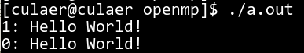

并行计算作业1
===


问题描述
---

使用`OpenMP`编写基本的`HelloWord`函数。


环境配置
---

- CPU：AMD A6-4455M 双核双线程
- OS: CentOS Linux release 7.6.1810 (Core)
- gcc: 4.8.5


程序
---


### 源码

``` c
#include <stdio.h>
#include <omp.h>

int
main(void)
{
  #pragma omp parallel
  {
    int id = omp_get_thread_num();
    printf("%d: Hello World!\n", id);
  }

  return 0;
}
```

### 编译及结果

1. 使用`gcc homework1.c -fopenmp`进行编译，得到`a.out`执行文件。

1. 运行`./a.out`，得到输出结果：
    

1. 由于硬件为双核双线程，因此得到了两行输出，结果符合预期。
