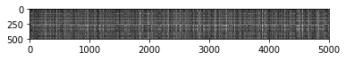
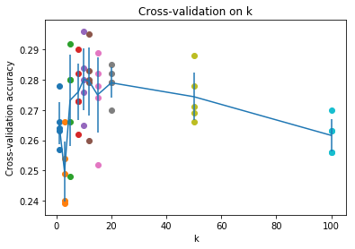
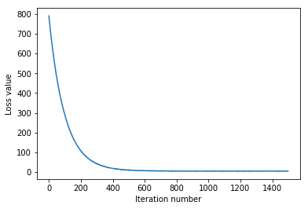
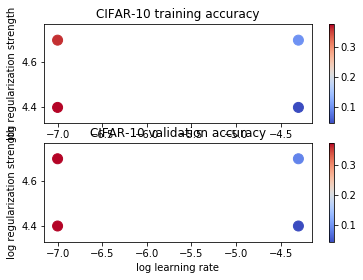
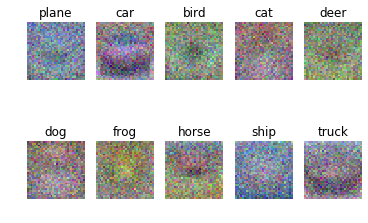
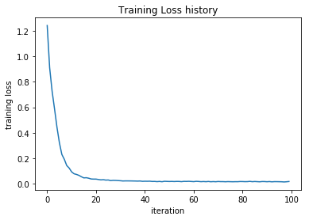
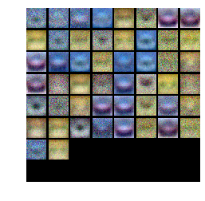
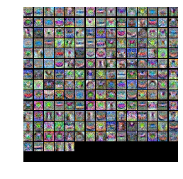

计算机视觉：算法与应用
===

作业要求：
---

实现以下分类算法：
- Q1：K近邻分类（20分）
- Q2：SVM分类（25分）
- Q3：Softmax分类（20分）
- Q4：两层神经网络（35分）

Q1：K近邻分类算法
---

1. 实现**两层循环**的`K近邻`算法：
    ``` python
    def compute_distances_two_loops(self, X):
      num_test = X.shape[0]
      num_train = self.X_train.shape[0]
      dists = np.zeros((num_test, num_train))
      for i in range(num_test):
        for j in range(num_train):
          # *****START OF YOUR CODE (DO NOT DELETE/MODIFY THIS LINE)*****
          dists[i, j] = np.sqrt(np.sum(np.square(X[i, :] - self.X_train[j, :])))
          # *****END OF YOUR CODE (DO NOT DELETE/MODIFY THIS LINE)*****
      return dists
    ```
    
    调用实现的方法：
    ``` python
    # Test your implementation:
    dists = classifier.compute_distances_two_loops(X_test)
    print(dists.shape)
    ```
    输出结果： `(500, 5000)`

1. 可视化距离矩阵向量如下图：

    

1. 实现**预测**的相关函数：
    * 代码实现
      ``` python
      def predict_labels(self, dists, k=1):
        num_test = dists.shape[0]
        y_pred = np.zeros(num_test)
        for i in range(num_test):
          closest_y = []
          # *****START OF YOUR CODE (DO NOT DELETE/MODIFY THIS LINE)*****
          closest_y = self.y_train[np.argsort(dists[i,:])[:k]]
          y_pred[i] = np.argmax(np.bincount(closest_y))
          # *****END OF YOUR CODE (DO NOT DELETE/MODIFY THIS LINE)*****
        return y_pred
      ```

    * 使用`k=1`在测试集调用测试：
      ``` python
      # We use k = 1 (which is Nearest Neighbor).
      y_test_pred = classifier.predict_labels(dists, k=1)

      # Compute and print the fraction of correctly predicted examples
      num_correct = np.sum(y_test_pred == y_test)
      accuracy = float(num_correct) / num_test
      print('Got %d / %d correct => accuracy: %f' % (num_correct, num_test, accuracy))
      ```
      输出结果为：
      `Got 137 / 500 correct => accuracy: 0.274000`

    * 使用`k=5`在测试集上进行测试：
      ``` python
      y_test_pred = classifier.predict_labels(dists, k=5)
      num_correct = np.sum(y_test_pred == y_test)
      accuracy = float(num_correct) / num_test
      print('Got %d / %d correct => accuracy: %f' % (num_correct, num_test, accuracy))
      ```
      输出结果为：
      `Got 139 / 500 correct => accuracy: 0.278000`

1. 使用向量的计算方式，只使用**一个循环**得到距离向量：
    * 代码实现：
      ``` python
      def compute_distances_one_loop(self, X):
        num_test = X.shape[0]
        num_train = self.X_train.shape[0]
        dists = np.zeros((num_test, num_train))
        for i in range(num_test):
          # *****START OF YOUR CODE (DO NOT DELETE/MODIFY THIS LINE)*****
          dists[i, :] = np.sqrt(np.sum(np.square(X[i, :] - self.X_train), axis=1))
          # *****END OF YOUR CODE (DO NOT DELETE/MODIFY THIS LINE)*****
        return dists
      ```
    * 进行调用，和之前的进行比较：
      ``` python
      dists_one = classifier.compute_distances_one_loop(X_test)

      # To ensure that our vectorized implementation is correct, we make sure that it
      # agrees with the naive implementation. There are many ways to decide whether
      # two matrices are similar; one of the simplest is the Frobenius norm. In case
      # you haven't seen it before, the Frobenius norm of two matrices is the square
      # root of the squared sum of differences of all elements; in other words, reshape
      # the matrices into vectors and compute the Euclidean distance between them.
      difference = np.linalg.norm(dists - dists_one, ord='fro')
      print('One loop difference was: %f' % (difference, ))
      if difference < 0.001:
          print('Good! The distance matrices are the same')
      else:
          print('Uh-oh! The distance matrices are different')
      ```

      输出结果为：
      ```
      One loop difference was: 0.000000
      Good! The distance matrices are the same
      ```

1. 完全使用**向量运算**来计算距离向量：
    * 实现代码
      ``` python
      def compute_distances_no_loops(self, X):
        num_test = X.shape[0]
        num_train = self.X_train.shape[0]
        dists = np.zeros((num_test, num_train)

        # *****START OF YOUR CODE (DO NOT DELETE/MODIFY THIS LINE)*****
        dists = np.multiply(np.dot(X, self.X_train.T), -2)
        dists = dists + np.sum(np.square(X), axis=1, keepdims=True)
        dists = dists + np.sum(np.square(self.X_train), axis=1, keepdims=True)
        dists = np.sqrt(dists.T)
        # *****END OF YOUR CODE (DO NOT DELETE/MODIFY THIS LINE)*****
        return dists
      ```

    * 进行调用，和之前的进行比较
      ``` python
      dists_two = classifier.compute_distances_no_loops(X_test)

      # check that the distance matrix agrees with the one we computed before:
      difference = np.linalg.norm(dists - dists_two, ord='fro')
      print('No loop difference was: %f' % (difference, ))
      if difference < 0.001:
          print('Good! The distance matrices are the same')
      else:
          print('Uh-oh! The distance matrices are different')
      ```

      结果输出为：
      ```
      No loop difference was: 0.000000
      Good! The distance matrices are the same
      ```

1. 三种算法运行时间比较，结果输出如下：
    ```
    Two loop version took 28.424671 seconds
    One loop version took 28.136103 seconds
    No loop version took 0.217311 seconds
    ```

1. 交叉验证
    * 代码实现部分：
      ``` python
      num_folds = 5
      k_choices = [1, 3, 5, 8, 10, 12, 15, 20, 50, 100]

      X_train_folds = []
      y_train_folds = []

      # *****START OF YOUR CODE (DO NOT DELETE/MODIFY THIS LINE)*****
      X_train_folds = np.array_split(X_train, num_folds)
      y_train_folds = np.array_split(y_train, num_folds)
      # *****END OF YOUR CODE (DO NOT DELETE/MODIFY THIS LINE)*****

      k_to_accuracies = {}

      # *****START OF YOUR CODE (DO NOT DELETE/MODIFY THIS LINE)*****
      for k in k_choices:
        accuracies = []
        for i in range(num_folds):
          classifier = KNearestNeighbor()

          X_train_fold, y_train_fold = [], []
          for j in range(num_folds):
            if i != j:
              X_train_fold.append(X_train_folds[j])
              y_train_fold.append(y_train_folds[j])
          X_train_fold, y_train_fold = np.vstack(X_train_fold), np.hstack(y_train_fold)
          classifier.train(X_train_fold, y_train_fold)

          X_test_fold, y_test_fold = X_train_folds[i], y_train_folds[i]

          y_test_pred = classifier.predict(X_test_fold, k=k)
          num_correct = np.sum(y_test_pred == y_test_fold)
          accuracy = float(num_correct) / len(y_test_fold)
          accuracies.append(accuracy)
        k_to_accuracies[k] = accuracies
      # *****END OF YOUR CODE (DO NOT DELETE/MODIFY THIS LINE)*****

      for k in sorted(k_to_accuracies):
        for accuracy in k_to_accuracies[k]:
            print('k = %d, accuracy = %f' % (k, accuracy))
      ```

    * 输出结果：
      ```
      k = 1, accuracy = 0.263000
      k = 1, accuracy = 0.257000
      k = 1, accuracy = 0.264000
      k = 1, accuracy = 0.278000
      k = 1, accuracy = 0.266000
      k = 3, accuracy = 0.239000
      k = 3, accuracy = 0.249000
      k = 3, accuracy = 0.240000
      k = 3, accuracy = 0.266000
      k = 3, accuracy = 0.254000
      k = 5, accuracy = 0.248000
      k = 5, accuracy = 0.266000
      k = 5, accuracy = 0.280000
      k = 5, accuracy = 0.292000
      k = 5, accuracy = 0.280000
      k = 8, accuracy = 0.262000
      k = 8, accuracy = 0.282000
      k = 8, accuracy = 0.273000
      k = 8, accuracy = 0.290000
      k = 8, accuracy = 0.273000
      k = 10, accuracy = 0.265000
      k = 10, accuracy = 0.296000
      k = 10, accuracy = 0.276000
      k = 10, accuracy = 0.284000
      k = 10, accuracy = 0.280000
      k = 12, accuracy = 0.260000
      k = 12, accuracy = 0.295000
      k = 12, accuracy = 0.279000
      k = 12, accuracy = 0.283000
      k = 12, accuracy = 0.280000
      k = 15, accuracy = 0.252000
      k = 15, accuracy = 0.289000
      k = 15, accuracy = 0.278000
      k = 15, accuracy = 0.282000
      k = 15, accuracy = 0.274000
      k = 20, accuracy = 0.270000
      k = 20, accuracy = 0.279000
      k = 20, accuracy = 0.279000
      k = 20, accuracy = 0.282000
      k = 20, accuracy = 0.285000
      k = 50, accuracy = 0.271000
      k = 50, accuracy = 0.288000
      k = 50, accuracy = 0.278000
      k = 50, accuracy = 0.269000
      k = 50, accuracy = 0.266000
      k = 100, accuracy = 0.256000
      k = 100, accuracy = 0.270000
      k = 100, accuracy = 0.263000
      k = 100, accuracy = 0.256000
      k = 100, accuracy = 0.263000
      ```

    * 数据可视化：

      

    * 交叉验证得出最好的结果进行测试，最有的测试结果如下：
      `Got 141 / 500 correct => accuracy: 0.282000`


Q2：SVM分类器
---

1. 实现原生的SVM损失函数
    * 实现代码
      ``` python
      def svm_loss_naive(W, X, y, reg):
        dW = np.zeros(W.shape) 

        # compute the loss and the gradient
        num_classes = W.shape[1]
        num_train = X.shape[0]
        loss = 0.0
        for i in range(num_train):
            scores = X[i].dot(W)
            correct_class_score = scores[y[i]]
            for j in range(num_classes):
                if j == y[i]:
                    continue
                margin = scores[j] - correct_class_score + 1 # note delta = 1
                if margin > 0:
                    loss += margin
                    dW[:, y[i]] += -X[i, :]
                    dW[:, j] += X[i, :]

        # Right now the loss is a sum over all training examples, but we want it
        # to be an average instead so we divide by num_train.
        loss /= num_train
        dW /= num_train

        # Add regularization to the loss.
        loss += reg * np.sum(W * W)

        # *****START OF YOUR CODE (DO NOT DELETE/MODIFY THIS LINE)*****
        dW += 2 * reg * W
        # *****END OF YOUR CODE (DO NOT DELETE/MODIFY THIS LINE)*****

        return loss, dW
      ```

    * 调用上述函数
      ``` python
      # generate a random SVM weight matrix of small numbers
      W = np.random.randn(3073, 10) * 0.0001 

      loss, grad = svm_loss_naive(W, X_dev, y_dev, 0.000005)
      print('loss: %f' % (loss, ))
      ```
      结果输出为：`loss: 9.253047`

    * 测试梯度
      ``` python
      # Compute the loss and its gradient at W.
      loss, grad = svm_loss_naive(W, X_dev, y_dev, 0.0)

      # Numerically compute the gradient along several randomly chosen dimensions, and
      # compare them with your analytically computed gradient. The numbers should match
      # almost exactly along all dimensions.
      from cs231n.gradient_check import grad_check_sparse
      f = lambda w: svm_loss_naive(w, X_dev, y_dev, 0.0)[0]
      grad_numerical = grad_check_sparse(f, W, grad)

      # do the gradient check once again with regularization turned on
      # you didn't forget the regularization gradient did you?
      loss, grad = svm_loss_naive(W, X_dev, y_dev, 5e1)
      f = lambda w: svm_loss_naive(w, X_dev, y_dev, 5e1)[0]
      grad_numerical = grad_check_sparse(f, W, grad)
      ```
      结果输出如下：
      ```
      numerical: -2.915200 analytic: -2.915200, relative error: 4.206067e-12
      numerical: -12.199717 analytic: -12.199717, relative error: 2.628844e-11
      numerical: -10.370984 analytic: -10.370984, relative error: 1.179444e-12
      numerical: 24.592603 analytic: 24.592603, relative error: 3.599433e-12
      numerical: 13.036840 analytic: 13.036840, relative error: 5.899847e-12
      numerical: 33.516746 analytic: 33.516746, relative error: 4.144634e-12
      numerical: 2.311752 analytic: 2.311752, relative error: 5.810500e-11
      numerical: -3.184427 analytic: -3.184427, relative error: 8.227825e-11
      numerical: -21.713213 analytic: -21.713213, relative error: 1.482069e-12
      numerical: 16.124959 analytic: 16.124959, relative error: 1.336914e-11
      numerical: -4.579021 analytic: -4.579021, relative error: 1.719226e-11
      numerical: -30.295794 analytic: -30.295794, relative error: 1.299911e-12
      numerical: -18.548602 analytic: -18.548602, relative error: 8.954279e-14
      numerical: 8.456500 analytic: 8.456500, relative error: 2.357546e-11
      numerical: 11.084412 analytic: 11.084412, relative error: 3.323093e-11
      numerical: -5.962759 analytic: -5.962759, relative error: 3.951161e-12
      numerical: 5.280279 analytic: 5.280279, relative error: 9.770312e-11
      numerical: 27.777040 analytic: 27.777040, relative error: 3.638786e-13
      numerical: 1.169892 analytic: 1.169892, relative error: 2.956418e-10
      numerical: 10.518728 analytic: 10.518728, relative error: 4.559642e-13
      ```

1. 实现向量计算的损失函数及梯度计算
    * 实现代码
      ``` python
      def svm_loss_vectorized(W, X, y, reg):
        loss = 0.0
        dW = np.zeros(W.shape) # initialize the gradient as zero

        # *****START OF YOUR CODE (DO NOT DELETE/MODIFY THIS LINE)*****
        num_train = X.shape[0]
        scores = X.dot(W)
        
        yi_scores = scores[np.arange(scores.shape[0]), y]
        yi_scores = np.expand_dims(yi_scores, axis=1)
        
        margins = np.maximum(0, scores-yi_scores+1)
        margins[np.arange(num_train), y] = 0
        loss = np.mean(np.sum(margins, axis=1))
        loss += reg * np.sum(W * W)

        margins[margins>0] = 1.0
        row_sum = np.sum(margins, axis=1)
        margins[np.arange(num_train), y] = -row_sum
        dW += np.dot(X.T, margins) / num_train
        dW += 2 * reg * W
        # *****END OF YOUR CODE (DO NOT DELETE/MODIFY THIS LINE)*****

        return loss, dW
      ```

    * 验证损失函数：
      ``` python
      tic = time.time()
      loss_naive, grad_naive = svm_loss_naive(W, X_dev, y_dev, 0.000005)
      toc = time.time()
      print('Naive loss: %e computed in %fs' % (loss_naive, toc - tic))

      from cs231n.classifiers.linear_svm import svm_loss_vectorized
      tic = time.time()
      loss_vectorized, _ = svm_loss_vectorized(W, X_dev, y_dev, 0.000005)
      toc = time.time()
      print('Vectorized loss: %e computed in %fs' % (loss_vectorized, toc - tic))

      # The losses should match but your vectorized implementation should be much faster.
      print('difference: %f' % (loss_naive - loss_vectorized))
      ```
      结果输出如下：
      ```
      Naive loss: 9.253047e+00 computed in 0.371910s
      Vectorized loss: 9.253047e+00 computed in 0.011547s
      difference: 0.000000
      ```

    * 验证梯度：
      ``` python
      tic = time.time()
      _, grad_naive = svm_loss_naive(W, X_dev, y_dev, 0.000005)
      toc = time.time()
      print('Naive loss and gradient: computed in %fs' % (toc - tic))

      tic = time.time()
      _, grad_vectorized = svm_loss_vectorized(W, X_dev, y_dev, 0.000005)
      toc = time.time()
      print('Vectorized loss and gradient: computed in %fs' % (toc - tic))

      # The loss is a single number, so it is easy to compare the values computed
      # by the two implementations. The gradient on the other hand is a matrix, so
      # we use the Frobenius norm to compare them.
      difference = np.linalg.norm(grad_naive - grad_vectorized, ord='fro')
      print('difference: %f' % difference)
      ```
      结果输出如下：
      ```
      Naive loss and gradient: computed in 0.332774s
      Vectorized loss and gradient: computed in 0.005370s
      difference: 0.000000
      ```

1. 随机梯度下降
    * 训练
      ``` python
      from cs231n.classifiers import LinearSVM
      svm = LinearSVM()
      tic = time.time()
      loss_hist = svm.train(X_train, y_train, learning_rate=1e-7, reg=2.5e4,
                            num_iters=1500, verbose=True)
      toc = time.time()
      print('That took %fs' % (toc - tic))
      ```
      结果输出：
      ```
      iteration 0 / 1500: loss 790.259653
      iteration 100 / 1500: loss 287.728822
      iteration 200 / 1500: loss 108.008507
      iteration 300 / 1500: loss 42.191347
      iteration 400 / 1500: loss 18.936552
      iteration 500 / 1500: loss 10.061278
      iteration 600 / 1500: loss 7.323352
      iteration 700 / 1500: loss 5.693838
      iteration 800 / 1500: loss 5.898458
      iteration 900 / 1500: loss 5.344283
      iteration 1000 / 1500: loss 5.620586
      iteration 1100 / 1500: loss 5.688581
      iteration 1200 / 1500: loss 4.988907
      iteration 1300 / 1500: loss 5.185675
      iteration 1400 / 1500: loss 5.381632
      That took 8.107948s
      ```

    * 损失函数曲线：

      

    * 准确率：
      ```
      training accuracy: 0.368122
      validation accuracy: 0.376000
      ```

1. 超参数搜索
    * 代码实现
      ``` python
      learning_rates = [1e-7, 5e-5]
      regularization_strengths = [2.5e4, 5e4]

      results = {}
      best_val = -1   # The highest validation accuracy that we have seen so far.
      best_svm = None # The LinearSVM object that achieved the highest validation rate.

      # *****START OF YOUR CODE (DO NOT DELETE/MODIFY THIS LINE)*****
      for lr in learning_rates:
        for rs in regularization_strengths:
          svm = LinearSVM()
          loss_hist = svm.train(X_train, y_trainlearning_rate=lr, reg=rs,
                                num_iters=1500, verbose=False)
          y_train_pred = svm.predict(X_train)
          y_val_pred = svm.predict(X_val)
          train_acc = np.mean(y_train == y_train_pred)
          val_acc = np.mean(y_val == y_val_pred)

          results[(lr, rs)] = (train_acc, val_acc)

          if val_acc > best_val:
            best_val = val_acc
            best_svm = svm
      # *****END OF YOUR CODE (DO NOT DELETE/MODIFY THIS LINE)*****

      # Print out results.
      for lr, reg in sorted(results):
        train_accuracy, val_accuracy = results[(lr, reg)]
        print('lr %e reg %e train accuracy: %f val accuracy: %f' % (
                    lr, reg, train_accuracy, val_accuracy))
          
      print('best validation accuracy achieved during cross-validation: %f' % best_val)
      ```
      输出结果为：
      ```
      lr 1.000000e-07 reg 2.500000e+04 train accuracy: 0.374102 val accuracy: 0.372000
      lr 1.000000e-07 reg 5.000000e+04 train accuracy: 0.359102 val accuracy: 0.372000
      lr 5.000000e-05 reg 2.500000e+04 train accuracy: 0.046449 val accuracy: 0.044000
      lr 5.000000e-05 reg 5.000000e+04 train accuracy: 0.100265 val accuracy: 0.087000
      best validation accuracy achieved during cross-validation: 0.372000
      ```

    * 可视化结果：

      

    * 在测试集上进行验证结果：
      `linear SVM on raw pixels final test set accuracy: 0.369000`

1. 可视化权重

  

Q3：Softmax分类器
---

1. 使用循环的方式计算损失函数及梯度
    * 代码实现：
      ``` python
      def softmax_loss_naive(W, X, y, reg):
        loss = 0.0
        dW = np.zeros_like(W)

        # *****START OF YOUR CODE (DO NOT DELETE/MODIFY THIS LINE)*****
        num_train = X.shape[0]
        num_classes = W.shape[1]
        
        for i in range(num_train):
            scores = X[i].dot(W)
            scores -= np.max(scores)
            prob = np.exp(scores)
            prob_sum = np.sum(prob)

            loss += -np.log(prob[y[i]] / prob_sum)
            dW[:, y[i]] -= X[i]
            
            for j in range(num_classes):
                dW[:, j] += prob[j] / prob_sum * X[i]
            
        loss = loss / num_train
        loss += reg * np.sum(np.square(W))
        dW = dW / num_train + reg * W
        # *****END OF YOUR CODE (DO NOT DELETE/MODIFY THIS LINE)*****

        return loss, dW
      ```
    * 验证损失函数：
      ``` python
      W = np.random.randn(3073, 10) * 0.0001
      loss, grad = softmax_loss_naive(W, X_dev, y_dev, 0.0)

      # As a rough sanity check, our loss should be something close to -log(0.1).
      print('loss: %f' % loss)
      print('sanity check: %f' % (-np.log(0.1)))
      ```
      输出结果为：
      ```
      loss: 2.383908
      sanity check: 2.302585
      ```

    * 验证梯度：
      ``` python
      loss, grad = softmax_loss_naive(W, X_dev, y_dev, 0.0)

      # As we did for the SVM, use numeric gradient checking as a debugging tool.
      # The numeric gradient should be close to the analytic gradient.
      from cs231n.gradient_check import grad_check_sparse
      f = lambda w: softmax_loss_naive(w, X_dev, y_dev, 0.0)[0]
      grad_numerical = grad_check_sparse(f, W, grad, 10)

      # similar to SVM case, do another gradient check with regularization
      loss, grad = softmax_loss_naive(W, X_dev, y_dev, 5e1)
      f = lambda w: softmax_loss_naive(w, X_dev, y_dev, 5e1)[0]
      grad_numerical = grad_check_sparse(f, W, grad, 10)
      ```
      结果输出为：
      ```
      numerical: 1.469064 analytic: 1.469064, relative error: 5.416515e-08
      numerical: 1.194579 analytic: 1.194579, relative error: 2.115913e-08
      numerical: 1.268045 analytic: 1.268045, relative error: 3.265064e-08
      numerical: -0.219258 analytic: -0.219258, relative error: 9.740588e-08
      numerical: -2.327887 analytic: -2.327887, relative error: 9.509480e-09
      numerical: 1.599763 analytic: 1.599763, relative error: 3.367226e-08
      numerical: -1.565819 analytic: -1.565819, relative error: 2.244661e-09
      numerical: 0.327181 analytic: 0.327181, relative error: 2.122854e-08
      numerical: 2.236898 analytic: 2.236898, relative error: 2.689039e-08
      numerical: 3.911376 analytic: 3.911375, relative error: 2.835678e-08
      numerical: 0.878461 analytic: 0.877288, relative error: 6.680451e-04
      numerical: 1.939342 analytic: 1.952386, relative error: 3.351703e-03
      numerical: 2.596801 analytic: 2.595503, relative error: 2.499158e-04
      numerical: 0.078642 analytic: 0.082561, relative error: 2.431120e-02
      numerical: -1.189613 analytic: -1.187190, relative error: 1.019255e-03
      numerical: 5.072593 analytic: 5.066704, relative error: 5.807666e-04
      numerical: -2.489953 analytic: -2.498382, relative error: 1.689747e-03
      numerical: -0.569445 analytic: -0.571582, relative error: 1.872887e-03
      numerical: -1.389908 analytic: -1.385435, relative error: 1.611846e-03
      numerical: -1.494868 analytic: -1.491863, relative error: 1.006200e-03
      ```

1. 实现使用向量计算的损失函数和梯度：
    * 代码实现：
      ``` python
      def softmax_loss_vectorized(W, X, y, reg):
        loss = 0.0
        dW = np.zeros_like(W)

        # *****START OF YOUR CODE (DO NOT DELETE/MODIFY THIS LINE)*****
        num_train = X.shape[0]

        scores = X.dot(W)
        scores -= np.max(scores, axis=1).reshape((-1, 1))
        prob = np.exp(scores)
        prob_sum = np.sum(prob, axis=1).reshape((-1, 1))

        loss = -np.mean(np.log(prob[range(num_train), y] / prob_sum))
        loss += reg * np.sum(np.square(W))

        gradients = prob / prob_sum
        gradients[range(num_train), y] -= 1
        dW = X.T.dot(gradients) / num_train
        dW += reg * W

        # *****END OF YOUR CODE (DO NOT DELETE/MODIFY THIS LINE)*****

        return loss, dW
      ```

    * 验证损失函数和梯度：
      ``` python
      tic = time.time()
      loss_naive, grad_naive = softmax_loss_naive(W, X_dev, y_dev, 0.000005)
      toc = time.time()
      print('naive loss: %e computed in %fs' % (loss_naive, toc - tic))

      from cs231n.classifiers.softmax import softmax_loss_vectorized
      tic = time.time()
      loss_vectorized, grad_vectorized = softmax_loss_vectorized(W, X_dev, y_dev, 0.000005)
      toc = time.time()
      print('vectorized loss: %e computed in %fs' % (loss_vectorized, toc - tic))

      # As we did for the SVM, we use the Frobenius norm to compare the two versions
      # of the gradient.
      grad_difference = np.linalg.norm(grad_naive - grad_vectorized, ord='fro')
      print('Loss difference: %f' % np.abs(loss_naive - loss_vectorized))
      print('Gradient difference: %f' % grad_difference)
      ```
      结果输出为：
      ```
      naive loss: 2.383908e+00 computed in 0.146434s
      vectorized loss: 2.383908e+00 computed in 0.015836s
      Loss difference: 0.000000
      Gradient difference: 0.000000
      ```

1. 搜索超参数
    * 实现代码：
      ``` python
      from cs231n.classifiers import Softmax
      results = {}
      best_val = -1
      best_softmax = None
      learning_rates = [1e-7, 5e-7]
      regularization_strengths = [2.5e4, 5e4]

      # *****START OF YOUR CODE (DO NOT DELETE/MODIFY THIS LINE)*****
      for lr in learning_rates:
        for rs in regularization_strengths:
          classifier = Softmax()
          loss_hist = classifier.train(X_train, y_trainlearning_rate=lr, reg=rs,
                                       num_iters=1500,verbose=False)
          y_train_pred = classifier.predict(X_train)
          y_val_pred = classifier.predict(X_val)
          train_acc = np.mean(y_train == y_train_pred)
          val_acc = np.mean(y_val == y_val_pred)

          results[(lr, rs)] = (train_acc, val_acc)

          if val_acc > best_val:
            best_val = val_acc
            best_softmax = classifier
      # *****END OF YOUR CODE (DO NOT DELETE/MODIFY THIS LINE)*****
      # Print out results.
      for lr, reg in sorted(results):
        train_accuracy, val_accuracy = results[(lr, reg)]
        print('lr %e reg %e train accuracy: %f val accuracy: %f' % (
                    lr, reg, train_accuracy, val_accuracy))
          
      print('best validation accuracy achieved during cross-validation: %f' % best_val)
      ```
      输出结果为：
      ```
      lr 1.000000e-07 reg 2.500000e+04 train accuracy: 0.342612 val accuracy: 0.353000
      lr 1.000000e-07 reg 5.000000e+04 train accuracy: 0.322714 val accuracy: 0.343000
      lr 5.000000e-07 reg 2.500000e+04 train accuracy: 0.346918 val accuracy: 0.352000
      lr 5.000000e-07 reg 5.000000e+04 train accuracy: 0.323367 val accuracy: 0.341000
      best validation accuracy achieved during cross-validation: 0.353000
      ```

    * 在测试集上验证：
      ``` python
      # evaluate on test set
      # Evaluate the best softmax on test set
      y_test_pred = best_softmax.predict(X_test)
      test_accuracy = np.mean(y_test == y_test_pred)
      print('softmax on raw pixels final test set accuracy: %f' % (test_accuracy, ))
      ```
      输出结果为：`softmax on raw pixels final test set accuracy: 0.352000`

1. 可视化权重

  

Q4：两层神经网络
---

1. 实现前向传播部分代码：
    * 代码实现：
      ``` python
      def loss(self, X, y=None, reg=0.0):
        # Unpack variables from the params dictionary
        W1, b1 = self.params['W1'], self.params['b1']
        W2, b2 = self.params['W2'], self.params['b2']
        N, D = X.shape

        # Compute the forward pass
        scores = None

        # *****START OF YOUR CODE (DO NOT DELETE/MODIFY THIS LINE)*****
        hidden = np.maximum(0, X.dot(W1) + b1)
        scores = hidden.dot(W2) + b2
        # *****END OF YOUR CODE (DO NOT DELETE/MODIFY THIS LINE)*****

        # If the targets are not given then jump out, we're done
        if y is None:
          return scores
      ```
    * 验证前向传播得到的`scores`：
      ``` python
      scores = net.loss(X)
      print('Your scores:')
      print(scores)
      print()
      print('correct scores:')
      correct_scores = np.asarray([
        [-0.81233741, -1.27654624, -0.70335995],
        [-0.17129677, -1.18803311, -0.47310444],
        [-0.51590475, -1.01354314, -0.8504215 ],
        [-0.15419291, -0.48629638, -0.52901952],
        [-0.00618733, -0.12435261, -0.15226949]])
      print(correct_scores)
      print()

      # The difference should be very small. We get < 1e-7
      print('Difference between your scores and correct scores:')
      print(np.sum(np.abs(scores - correct_scores)))
      ```
      输出结果如下：
      ```
      Your scores:
      [[-0.81233741 -1.27654624 -0.70335995]
      [-0.17129677 -1.18803311 -0.47310444]
      [-0.51590475 -1.01354314 -0.8504215 ]
      [-0.15419291 -0.48629638 -0.52901952]
      [-0.00618733 -0.12435261 -0.15226949]]

      correct scores:
      [[-0.81233741 -1.27654624 -0.70335995]
      [-0.17129677 -1.18803311 -0.47310444]
      [-0.51590475 -1.01354314 -0.8504215 ]
      [-0.15419291 -0.48629638 -0.52901952]
      [-0.00618733 -0.12435261 -0.15226949]]

      Difference between your scores and correct scores:
      3.6802720745909845e-08
      ```

1. 损失函数以及反向传播计算梯度
    * 实现代码：
      ``` python
      def loss(self, X, y=None, reg=0.0):
        # Unpack variables from the params dictionary
        W1, b1 = self.params['W1'], self.params['b1']
        W2, b2 = self.params['W2'], self.params['b2']
        N, D = X.shape

        # Compute the forward pass
        scores = None

        # *****START OF YOUR CODE (DO NOT DELETE/MODIFY THIS LINE)*****
        hidden = np.maximum(0, X.dot(W1) + b1)
        scores = hidden.dot(W2) + b2
        # *****END OF YOUR CODE (DO NOT DELETE/MODIFY THIS LINE)*****

        # If the targets are not given then jump out, we're done
        if y is None:
          return scores

        # Compute the loss
        loss = None

        # *****START OF YOUR CODE (DO NOT DELETE/MODIFY THIS LINE)*****
        exp_scores = np.exp(scores)
        probs = exp_scores / np.sum(exp_scores, axis=1, keepdims=True)

        correct_logprobs = -np.log(probs[range(N), y])
        loss = np.mean(correct_logprobs)
        loss += reg * (np.sum(np.square(W1)) + np.sum(np.square(W2)))
        # *****END OF YOUR CODE (DO NOT DELETE/MODIFY THIS LINE)*****

        # Backward pass: compute gradients
        grads = {}

        # *****START OF YOUR CODE (DO NOT DELETE/MODIFY THIS LINE)*****
        dscores = probs
        dscores[range(N), y] -= 1
        dscores /= N
        
        dW2 = hidden.T.dot(dscores) + 2 * reg * W2
        db2 = np.sum(dscores, axis=0, keepdims=True)
        
        dhidden = dscores.dot(W2.T)
        dhidden[hidden<=0] = 0
        
        dW1 = X.T.dot(dhidden) + 2 * reg * W1
        db1 = np.sum(dhidden, axis=0, keepdims=True)
        
        grads['W1'] = dW1
        grads['b1'] = db1
        grads['W2'] = dW2
        grads['b2'] = db2
        # *****END OF YOUR CODE (DO NOT DELETE/MODIFY THIS LINE)*****

        return loss, grads
      ```

    * 验证损失函数
      ``` python
      loss, _ = net.loss(X, y, reg=0.05)
      correct_loss = 1.30378789133

      # should be very small, we get < 1e-12
      print('Difference between your loss and correct loss:')
      print(np.sum(np.abs(loss - correct_loss)))
      ```
      结果输出如下：
      ```
      Difference between your loss and correct loss:
      1.7985612998927536e-13
      ```

    * 验证梯度计算
      ``` python
      loss, grads = net.loss(X, y, reg=0.05)

      # these should all be less than 1e-8 or so
      for param_name in grads:
          f = lambda W: net.loss(X, y, reg=0.05)[0]
          param_grad_num = eval_numerical_gradient(f, net.params[param_name], verbose=False)
          print('%s max relative error: %e' % (param_name, rel_error(param_grad_num, grads[param_name])))
      ```
      输出结果如下：
      ```
      W1 max relative error: 3.561318e-09
      b1 max relative error: 2.738421e-09
      W2 max relative error: 3.440708e-09
      b2 max relative error: 4.447646e-11
      ```

1. 网络的训练
    * 训练部分实现代码：
      ``` python
      def train(self, X, y, X_val, y_val,
                learning_rate=1e-3, learning_rate_decay=0.95,
                reg=5e-6, num_iters=100,
                batch_size=200, verbose=False):
        num_train = X.shape[0]
        iterations_per_epoch = max(num_train / batch_size, 1)

        # Use SGD to optimize the parameters in self.model
        loss_history = []
        train_acc_history = []
        val_acc_history = []

        for it in range(num_iters):
          X_batch = None
          y_batch = None

          # *****START OF YOUR CODE (DO NOT DELETE/MODIFY THIS LINE)*****
          indices = np.random.choice(num_train, batch_size)
          X_batch = X[indices]
          y_batch = y[indices]
          # *****END OF YOUR CODE (DO NOT DELETE/MODIFY THIS LINE)*****

          # Compute loss and gradients using the current minibatch
          loss, grads = self.loss(X_batch, y=y_batch, reg=reg)
          loss_history.append(loss)

          # *****START OF YOUR CODE (DO NOT DELETE/MODIFY THIS LINE)*****
          for g in grads.keys():
            gradient = learning_rate * grads[g]
            if g[0] == 'b':
              gradient = gradient.reshape(-1)
            self.params[g] -= gradient
          # *****END OF YOUR CODE (DO NOT DELETE/MODIFY THIS LINE)*****

          if verbose and it % 100 == 0:
            print('iteration %d / %d: loss %f' % (it, num_iters, loss))

          # Every epoch, check train and val accuracy and decay learning rate.
          if it % iterations_per_epoch == 0:
            # Check accuracy
            train_acc = (self.predict(X_batch) == y_batch).mean()
            val_acc = (self.predict(X_val) == y_val).mean()
            train_acc_history.append(train_acc)
            val_acc_history.append(val_acc)

            # Decay learning rate
            learning_rate *= learning_rate_decay

        return {
          'loss_history': loss_history,
          'train_acc_history': train_acc_history,
          'val_acc_history': val_acc_history,
        }
      ```

    * 预测部分实现代码：
      ``` python
      def predict(self, X):
        y_pred = None

        # *****START OF YOUR CODE (DO NOT DELETE/MODIFY THIS LINE)*****
        W1, b1 = self.params['W1'], self.params['b1']
        W2, b2 = self.params['W2'], self.params['b2']
        hidden = np.maximum(0, X.dot(W1) + b1)
        scores = hidden.dot(W2) + b2
        y_pred = np.argmax(scores, axis=1)
        # *****END OF YOUR CODE (DO NOT DELETE/MODIFY THIS LINE)*****

        return y_pred
      ```

    * 训练得到的损失函数：

      

1. 在CIFAR数据集上使用神经网络
    * 训练网络
      ``` python
      input_size = 32 * 32 * 3
      hidden_size = 50
      num_classes = 10
      net = TwoLayerNet(input_size, hidden_size, num_classes)

      # Train the network
      stats = net.train(X_train, y_train, X_val, y_val,
                  num_iters=1000, batch_size=200,
                  learning_rate=1e-4, learning_rate_decay=0.95,
                  reg=0.25, verbose=True)

      # Predict on the validation set
      val_acc = (net.predict(X_val) == y_val).mean()
      print('Validation accuracy: ', val_acc)
      ```
      结果输出：
      ```
      iteration 0 / 1000: loss 2.302954
      iteration 100 / 1000: loss 2.302550
      iteration 200 / 1000: loss 2.297648
      iteration 300 / 1000: loss 2.259602
      iteration 400 / 1000: loss 2.204170
      iteration 500 / 1000: loss 2.118565
      iteration 600 / 1000: loss 2.051535
      iteration 700 / 1000: loss 1.988466
      iteration 800 / 1000: loss 2.006591
      iteration 900 / 1000: loss 1.951473
      Validation accuracy:  0.287
      ```

    * 对损失函数和准确率进行可视化

      

    * 权重的可视化

      

1. 搜索超参数
    * 实现代码
      ``` python
      best_net = None # store the best model into this

      # *****START OF YOUR CODE (DO NOT DELETE/MODIFY THIS LINE)*****
      best_acc = 0
      input_size = 32 * 32 * 3
      num_classes = 10

      hidden_sizes = [50, 100, 200]
      train_epochs = [1500, 2000, 2500]
      learning_rates = [1e-3, 1e-4, 1e-5]

      for lr in learning_rates:
        for num_iters in train_epochs:
          for hidden_size in hidden_sizes:
            net = TwoLayerNet(input_size, hidden_size, num_classes)
            stats = net.train(X_train, y_train, X_val, y_val,
                              num_iters=num_iters, batch_size=200,
                              learning_rate=lr, learning_rate_decay=0.9,
                              reg=0.5, verbose=False)

            val_acc = (net.predict(X_val) == y_val).mean()
            if val_acc > best_acc:
              best_acc = val_acc
              best_net = net

              print('learning_rate: %g, hidden_size: %d, num_iters: %d => acc: %g' % (lr, hidden_size, num_iters, val_acc))
      # *****END OF YOUR CODE (DO NOT DELETE/MODIFY THIS LINE)*****best_acc = 0
      ```
      输出结果为：
      ```
      learning_rate: 0.001, hidden_size: 50, num_iters: 1500 => acc: 0.474
      learning_rate: 0.001, hidden_size: 100, num_iters: 1500 => acc: 0.472
      learning_rate: 0.001, hidden_size: 200, num_iters: 1500 => acc: 0.491
      learning_rate: 0.001, hidden_size: 50, num_iters: 2000 => acc: 0.488
      learning_rate: 0.001, hidden_size: 100, num_iters: 2000 => acc: 0.498
      learning_rate: 0.001, hidden_size: 200, num_iters: 2000 => acc: 0.511
      learning_rate: 0.001, hidden_size: 50, num_iters: 2500 => acc: 0.493
      learning_rate: 0.001, hidden_size: 100, num_iters: 2500 => acc: 0.497
      learning_rate: 0.001, hidden_size: 200, num_iters: 2500 => acc: 0.51
      learning_rate: 0.0001, hidden_size: 50, num_iters: 1500 => acc: 0.309
      learning_rate: 0.0001, hidden_size: 100, num_iters: 1500 => acc: 0.31
      learning_rate: 0.0001, hidden_size: 200, num_iters: 1500 => acc: 0.317
      learning_rate: 0.0001, hidden_size: 50, num_iters: 2000 => acc: 0.327
      learning_rate: 0.0001, hidden_size: 100, num_iters: 2000 => acc: 0.337
      learning_rate: 0.0001, hidden_size: 200, num_iters: 2000 => acc: 0.348
      learning_rate: 0.0001, hidden_size: 50, num_iters: 2500 => acc: 0.347
      learning_rate: 0.0001, hidden_size: 100, num_iters: 2500 => acc: 0.353
      learning_rate: 0.0001, hidden_size: 200, num_iters: 2500 => acc: 0.366
      learning_rate: 1e-05, hidden_size: 50, num_iters: 1500 => acc: 0.234
      learning_rate: 1e-05, hidden_size: 100, num_iters: 1500 => acc: 0.213
      learning_rate: 1e-05, hidden_size: 200, num_iters: 1500 => acc: 0.26
      learning_rate: 1e-05, hidden_size: 50, num_iters: 2000 => acc: 0.193
      learning_rate: 1e-05, hidden_size: 100, num_iters: 2000 => acc: 0.214
      learning_rate: 1e-05, hidden_size: 200, num_iters: 2000 => acc: 0.23
      learning_rate: 1e-05, hidden_size: 50, num_iters: 2500 => acc: 0.206
      learning_rate: 1e-05, hidden_size: 100, num_iters: 2500 => acc: 0.187
      learning_rate: 1e-05, hidden_size: 200, num_iters: 2500 => acc: 0.191
      ```

    * 最优解权重的可视化：

      

    * 测试集上的效果：
      ``` python
      test_acc = (best_net.predict(X_test) == y_test).mean()
      print('Test accuracy: ', test_acc)
      ```
      输出结果为：`Test accuracy:  0.498`
